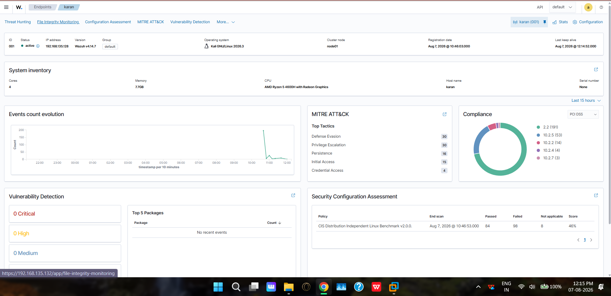

# 🛡️ Home SOC Lab — Wazuh SIEM \+ Attack Detection

A fully functional home Security Operations Center (SOC) lab built to simulate real-world attacks, detect them using a SIEM, and map findings to the MITRE ATT\&CK framework.

---

## 📌 Project Overview

This lab was built to gain hands-on experience with threat detection, detection engineering, and SOC workflows — going beyond theory into actual attack simulation and analysis.

**Key goals:**

- Simulate a real attacker → defender scenario  
- Detect attacks using Wazuh SIEM with ELK Stack  
- Map all detections to MITRE ATT\&CK techniques  
- Write custom detection rules from scratch  
- Tune false positives like a real SOC analyst  
- Visualize everything in a custom Kibana dashboard

---

## 🏗️ Lab Architecture

┌─────────────────────┐         ┌──────────────────────────┐

│   Kali Linux VM      │────────▶│   Ubuntu Server 26.04    │

│   (Attacker \+        │◀────────│   Wazuh Manager v4.14.7  │

│    Monitored Agent)  │         │   \+ ELK Stack             │

│   192.168.135.128    │         │   192.168.135.132         │

└─────────────────────┘         └──────────────────────────┘

          │                                  │

          └──────────────────────────────────┘

                    VMware Host-Only Network

          ┌─────────────────────┐

          │   Windows Host       │

          │   (Browser →         │

          │    Kibana Dashboard) │

          └─────────────────────┘

**Host Machine:** AMD Ryzen 5 4600H, 24GB RAM, GTX 1650 Ti **Hypervisor:** VMware Workstation Pro **SIEM:** Wazuh v4.14.7 (all-in-one deployment) **Attacker/Agent:** Kali GNU/Linux 2026.3

---

## ⚔️ Attack Chain Simulated

The lab simulates a complete attacker kill chain from initial recon to persistence:

| Stage | Attack | Tool | MITRE Technique |
| :---- | :---- | :---- | :---- |
| Reconnaissance | Port & service scan | nmap | T1595 |
| Credential Access | SSH brute force | Hydra | T1110 |
| Execution | Reverse shell | Metasploit msfvenom | T1059 |
| Persistence | Backdoor user creation | useradd | T1136.001 |
| Privilege Escalation | Sudo abuse | sudo | T1548.003 |
| Discovery | SUID binary enumeration | find | T1548 |
| Defense Evasion | Log clearing attempt | sh | T1070 |

---

## 🔍 Detection Engineering

### Custom Rules Written

All custom rules written in `/var/ossec/etc/rules/local_rules.xml`:

\<\!-- Rule 100002: SUID Enumeration Detection \--\>

\<group name="suid\_scan,"\>

  \<rule id="100002" level="12"\>

    \<if\_sid\>0\</if\_sid\>

    \<match\>-perm \-4000\</match\>

    \<description\>Possible SUID binary enumeration detected\</description\>

    \<mitre\>

      \<id\>T1548\</id\>

    \</mitre\>

  \</rule\>

\</group\>

\<\!-- Rule 100003: Auditd Command Execution \--\>

\<group name="audit\_commands,"\>

  \<rule id="100003" level="10"\>

    \<if\_sid\>80791\</if\_sid\>

    \<description\>Auditd: Command executed on system\</description\>

    \<mitre\>

      \<id\>T1059\</id\>

    \</mitre\>

  \</rule\>

\</group\>

### False Positive Tuning

Suppressed known lab noise to reduce alert fatigue:

\<\!-- Suppress normal PAM logins and sudo in lab environment \--\>

\<group name="false\_positives,"\>

  \<rule id="100005" level="0"\>

    \<if\_sid\>5501\</if\_sid\>

    \<description\>FP: Normal PAM login session in lab environment\</description\>

  \</rule\>

  \<rule id="100006" level="0"\>

    \<if\_sid\>5402\</if\_sid\>

    \<description\>FP: Expected sudo to root in lab environment\</description\>

  \</rule\>

\</group\>

### auditd Configuration

Configured Linux Audit Daemon for deep command-level logging:

sudo auditctl \-a always,exit \-F arch=b64 \-S execve \-k command\_exec

Added to Wazuh log collection in `ossec.conf`:

\<localfile\>

  \<log\_format\>audit\</log\_format\>

  \<location\>/var/log/audit/audit.log\</location\>

\</localfile\>

---

## 📊 MITRE ATT\&CK Coverage

Tactics detected and mapped automatically by Wazuh:

| Tactic | Count | Techniques |
| :---- | :---- | :---- |
| Defense Evasion | 30 | T1078, T1548.003 |
| Privilege Escalation | 30 | T1548.003, T1548 |
| Persistence | 16 | T1078, T1136 |
| Initial Access | 15 | T1078 |
| Credential Access | 4 | T1110, T1110.001 |

---

## 📈 Dashboard

Custom Kibana dashboard built with 4 panels:

- **Alerts Over Time** — Bar chart showing attack activity spikes  
- **Top MITRE Tactics** — Donut chart of tactic distribution  
- **Top Alert Types** — Data table with rule descriptions and severity  
- **Total Alerts** — Metric widget (648 total alerts captured)

### Screenshots

.png)
.png)

.jpeg)
.jpeg)

---

## 🔧 Tools Used

| Tool | Purpose |
| :---- | :---- |
| Wazuh v4.14.7 | SIEM — log collection, correlation, alerting |
| ELK Stack | Log indexing and visualization |
| Kali Linux | Attack simulation platform |
| nmap | Network reconnaissance |
| Hydra | SSH brute force |
| Metasploit Framework | Reverse shell / exploitation |
| auditd | Deep command-level logging on Linux |
| VMware Workstation Pro | Hypervisor |

---

## 📋 Key Takeaways

- Learned how a SIEM ingests, normalizes, and correlates logs from multiple sources  
- Understood the difference between detection rules and false positive tuning  
- Gained hands-on experience writing Wazuh XML detection rules  
- Mapped real attack techniques to MITRE ATT\&CK framework manually and automatically  
- Built end-to-end visibility from attack execution to dashboard visualization

---

## 🚀 Future Improvements

- [ ] Add Windows VM as additional monitored endpoint  
- [ ] Simulate lateral movement between VMs  
- [ ] Configure email/Slack alerting for high severity events  
- [ ] Add Suricata IDS for network-level detection  
- [ ] Automate attack simulations with scripts

---

*Built as part of ongoing cybersecurity skill development alongside CompTIA Security+ certification study.*  
